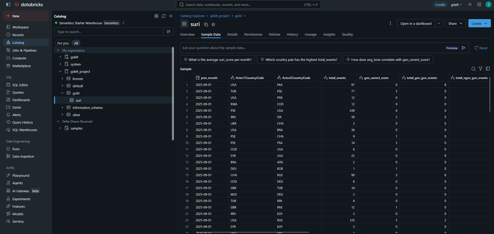
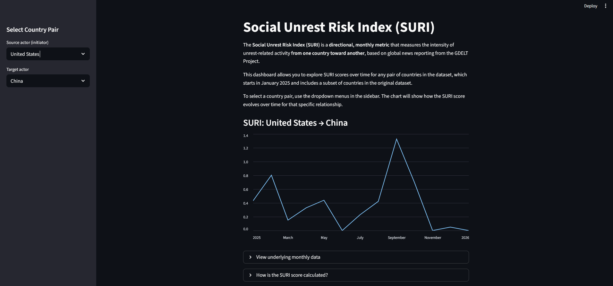

# GDELT

## Overview

The goal of this project is to quantify the risk of social unrest between pairs of countries, or between actors within the same country, using a novel index called the Social Unrest Risk Index (SURI). The original research underlying this work was completed at the Federal Reserve and was later [presented](https://www.bancaditalia.it/pubblicazioni/altri-atti-convegni/2025-ifc/S2.1_1_Turbulent-times.pdf) at the 4th IFC Bank of International Settlements workshop on Data Science in Central Banking at Banca d’Italia.

While an internal GDELT-based database already exists at the Federal Reserve, this repository was created to explore Databricks as an alternative platform for large-scale event data ingestion, transformation, and analytics. The project demonstrates that Databricks can meet the requirements of this use case while offering strong governance, scalability, and ease of development out of the box.

The core deliverables are a Databricks-based data lakehouse built using a medallion architecture (Bronze → Silver → Gold) and a Dockerized Streamlit dashboard that allows users to explore monthly SURI trends between selected country pairs.

## How to run the dashboard

The dashboard is packaged as a Docker container so it can be run locally without access to Databricks. Docker is the only prerequisite. 

From the root folder of the repository, run the following commands:

```
cd dashboard
docker build -t suri_dashboard .
```

Once the image is built, start the container with:

```
docker run -p 8501:8501 suri_dashboard
```

The dashboard will be available at: http://localhost:8501.

## Architecture

The project is implemented as a Delta Lake-backed lakehouse on Databricks, following a medallion architecture that separates raw ingestion, cleaned data, and analytics-ready outputs.

At a high level, raw GDELT event files flow into Databricks, are incrementally processed through Bronze and Silver layers, aggregated into monthly SURI scores in the Gold layer, and finally exported to .csv for use by the dashboard.

```
GDELT Events
   ↓
Databricks (AWS)
   ├── Bronze: Raw events
   ├── Silver: Cleaned & filtered events
   └── Gold: Monthly SURI scores
   ↓
.csv Export
   ↓
Dockerized Streamlit App
```

The platform runs on Databricks on AWS, with data stored in Amazon S3 and managed using Delta Lake tables. Unity Catalog is used as the metastore, providing centralized management of catalogs, schemas, and table locations. All transformations are executed as Spark batch jobs orchestrated using Databricks Jobs.

Each layer of the medallion architecture is implemented as a standalone, date-parameterized Databricks job. Jobs are deterministic and re-runnable, making it straightforward to backfill historical data or reprocess individual days when needed. 

Dependencies between layers are linear (Bronze → Silver → Gold), which simplifies debugging and makes it easy to extend the pipeline with additional downstream analytics tables in the future.

The Gold-layer SURI table is periodically exported to .csv format for use by the Streamlit dashboard. This design choice keeps the visualization layer lightweight and portable, and it ensures that the final analytics output remains accessible even if the Databricks environment is no longer available.

## Data Source

This project uses event-level data from the GDELT Project (Global Database of Events, Language, and Tone), which monitors global news media in near real time and extracts structured information about political, social, and economic events using NLP techniques.

Each GDELT record represents an action performed by Actor 1 on Actor 2, along with metadata such as event classification, tone, and media coverage intensity. Key fields used in this project include event dates, actor country codes and types, CAMEO event codes, and measures of tone, mentions, sources, and articles.

The pipeline focuses specifically on unrest-related events, identified using CAMEO root event codes associated with demands, threats, and protests. These events are ingested into Databricks, cleaned and filtered, and then aggregated into monthly metrics used to compute SURI scores.

The GDELT data is publicly available at: https://www.gdeltproject.org/.

## Pipeline

As of writing, the data pipeline is run daily. Each run downloads all GDELT event files published for the previous day (files are released every 15 minutes) and processes them through the Bronze and Silver layers. When a run corresponds to the final day of a month, the Gold layer is updated with newly computed SURI scores.

Each layer of the pipeline does following:

### Bronze Layer

- Ingests raw GDELT event data
- Applies minimal validation (schema checks and required fields)
- Stores data in Delta format
- Uses incremental ingestion to limit reprocessing
- Partitioned by the date of the input file

### Silver Layer

- Cleans and normalizes event data
- Filters to a predefined set of geopolitically relevant countries to control data volume and cost
- Removes duplicate events
- Applies schema validation and data quality checks
- Partitioned by event date and optimized for query access (Z-orders by (Actor1CountryCode, Actor2CountryCode))

### Gold Layer

- Aggregates cleaned events into monthly, directional country-to-country metrics
- Computes intermediate measures such as:
    - Total events
    - Geopolitical Unrest Scores
    - Political Involvement Scores
- Computes the final Social Unrest Risk Index (SURI)
- Stores analytics-ready data in a Delta table partitioned by year-month

The gold table is periodically exported to .csv for use by the dashboard. Below is a screenshot of sample data from the Gold table.



## Dashboard

The dashboard is implemented as a Streamlit application and packaged in a Docker container so it can be run locally without Databricks access

Users can select source and target countries using dropdown menus populated with full country names and explore interactive time series visualizations of monthly SURI scores. Additional contextual metrics, such as unrest event counts and political involvement, are displayed alongside the main index in a table below the chart. The dashboard also includes a plain-language description of how the SURI score is constructed to support interpretability.

All data is loaded from a .csv export of the Gold table, allowing the dashboard to be shared and run independently of the Databricks environment.
 
Below is a screenshot of the dashboard with the source country set to the United States and the target country set to China. When the line is higher in the chart, the level of social unrest directed from the United States toward China, as measured by SURI, is higher.



## Design Decisions and Tradeoffs

Monthly aggregation was chosen over daily aggregation to reduce noise and storage costs while highlighting longer-term trends. The analysis is restricted to a subset of geopolitically significant countries to control data volume and Databricks compute costs.

Traditional database indexing is avoided in favor of Delta Lake partitioning and Z-ordering, which are better suited to large-scale analytical workloads. Finally, .csv exports are used for visualization rather than direct database queries to keep the dashboard simple, portable, and inexpensive to run.

## Future Work

Potential extensions of the project include:

- Backfill the data lakehouse further, as costs permit (GDELT 2.0 event data begins in 2015)
- Analyze the relationship between SURI and economic measures such as trade flows and portfolio flows
- Use the GDELT data to construct other unrest indices
- Test alternative weighting schemes for unrest and political involvement
- Set up CI/CD for pipeline updates
- Deploy the dashboard to a hosted environment
- Add more tests to ensure the pipeline and dashboard are working properly
